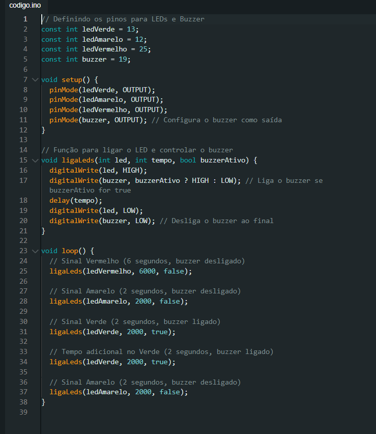

# Projeto de Semáforo
## Desenvolvido por Marco Ruas Sales Peixoto

## Descrição Geral do Projeto
Neste projeto, desenvolvi um sistema de controle de semáforo utilizando um ESP32. Utilizei LEDs para representar as luzes de trânsito (verde, amarelo e vermelho) e adicionei um buzzer para indicar ao pedestre quando o sinal verde está ativo, auxiliando, assim, pedestres com deficiência visual.

### Objetivos e Funções Implementadas
O sistema de semáforo foi programado para alternar entre as fases de forma contínua, com os seguintes tempos para cada fase:
- **Vermelho**: 6 segundos (indica parada para os veículos)
- **Amarelo**: 2 segundos (indica atenção para a mudança de fase)
- **Verde**: 2 segundos, com um buzzer ativo para pedestres
- **Tempo adicional no Verde**: mais 2 segundos para garantir a travessia completa
- **Amarelo (final)**: mais 2 segundos antes de retornar ao vermelho

Para tornar o código modular e mais fácil de entender, criei a função `ligaLeds`, que recebe parâmetros para o LED, o tempo de espera e a indicação de buzzer ligado ou desligado.

## Código Fonte

Clique aqui para acessar o [código](https://youtu.be/CyXPRGUTpEY).

## Imagem do código

  
 <b>Figura 1 </b> - Código do projeto

 
<b>Fonte:</b> Material elaborado pelo autor (2024)

### Explicação do Código

1. **Definição dos Pinos**: No início do código, defini os pinos usados para os LEDs de cada cor e o buzzer.
2. **Função `setup()`**: Configura todos os pinos dos LEDs e do buzzer como saídas.
3. **Função `ligaLeds`**:
   - Recebe três parâmetros: o pino do LED (`led`), o tempo que o LED ficará ligado (`tempo`), e um booleano (`buzzerAtivo`) que indica se o buzzer deve ser ativado.
   - A função acende o LED correspondente e, se `buzzerAtivo` for `true`, ativa o buzzer.
   - Após o tempo definido, desliga o LED e o buzzer.
4. **Função `loop()`**:
   - Controla a sequência das fases do semáforo.
   - Utiliza a função `ligaLeds` para ligar cada LED e controlar o buzzer, garantindo o funcionamento correto das fases e do aviso sonoro.

### Componentes Utilizados e Conexões

| Componente      | Especificação          | Função no Projeto                        |
|-----------------|------------------------|------------------------------------------|
| ESP32           | Microcontrolador       | Controle geral do semáforo               |
| LED Verde       | 5mm, 20mA, 2.1V        | Indica permissão para passagem           |
| LED Amarelo     | 5mm, 20mA, 2.1V        | Indica atenção                           |
| LED Vermelho    | 5mm, 20mA, 2.1V        | Indica parada                            |
| Buzzer          | 5V, piezoelétrico      | Indica fase verde para pedestres         |
| Resistores      | 220Ω                   | Protegem os LEDs                         |
| Protoboard      | -                      | Montagem dos componentes                 |
| Jumpers         | -                      | Conexão entre componentes e ESP32        |

## Esquema de Conexão
- **LED Verde** conectado ao pino **13** com resistor de **220Ω**.
- **LED Amarelo** ao pino **12** com resistor de **220Ω**.
- **LED Vermelho** ao pino **25** com resistor de **220Ω**.
- **Buzzer** ao pino **19**.

## Resultado da Simulação
Para acessar o vídeo do resultado clique [aqui]()

## Avaliação por Pares

### Avaliador 1: Giovanna Fátima de Britto Vieira

| Critério                                                                                                 | Pontos | Observações do Avaliador |
|---------------------------------------------------------------------------------------------------------|--------|---------------------------|
| Montagem física com cores corretas, boa disposição dos fios e uso adequado de resistores                | 3      | Montagem correta e organizada. Sugestão de usar menos jumpers em projetos futuros. |
| Temporização adequada conforme tempos medidos com auxílio de algum instrumento externo                  | 3      | O projeto segue a temporização proposta. |
| Código implementa corretamente as fases do semáforo e estrutura do código                               | 3      | Código bem estruturado e de fácil compreensão. |
| Extra: Implementação de componente adicional e/ou uso de ponteiros                                      | 1      | Buzzer adicionado para sinalização e código modularizado. |
| **Pontuação Total:**                                                                                    | **10** |                               |

### Avaliador 2: Isadora Tribst Gatto

| Critério                                                                                                 | Pontos | Observações do Avaliador |
|---------------------------------------------------------------------------------------------------------|--------|---------------------------|
| Montagem física com cores corretas, boa disposição dos fios e uso adequado de resistores                | 3      | Cores e conexões corretas; sugestão de usar menos fios. |
| Temporização adequada conforme tempos medidos com auxílio de algum instrumento externo                  | 3      | Temporização correta. |
| Código implementa corretamente as fases do semáforo e estrutura do código                               | 3      | Código bem estruturado e de fácil compreensão. |
| Extra: Implementação de componente adicional e/ou uso de ponteiros                                      | 1      | Uso do buzzer para auxiliar na travessia dos pedestres. |
| **Pontuação Total:**                                                                                    | **10** |                               |

## Conclusão
Este projeto foi uma experiência prática  para desenvolver um sistema de semáforo básico, aplicando conhecimentos de programação no ESP32 e controle de componentes eletrônicos. A modularização do código, com a criação da função `ligaLeds`, simplificou o controle de cada fase e permitiu integrar o buzzer com facilidade. O feedback recebido destacou a organização do código e sugeriu formas de otimizar a montagem física para projetos futuros.
